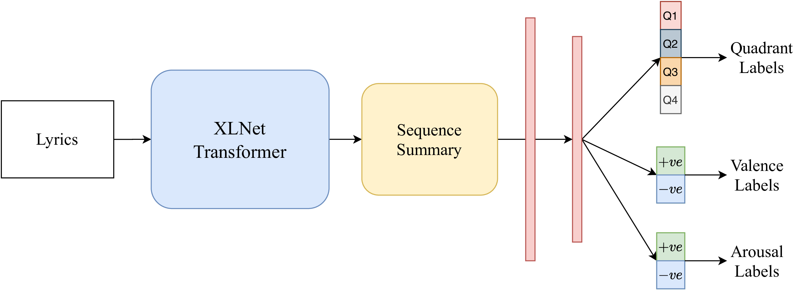

# MER-lyrics-Transformer
Official Repository of "Transformer-based approach towards music emotion recognition from lyrics" accepted in ECIR 2021
# Transformer-based approach towards music emotion recognition from lyrics

Yudhik Agrawal, Ramaguru Guru Ravi Shanker, Vinoo Alluri

[Proceeding Link](https://link.springer.com/chapter/10.1007%2F978-3-030-72240-1_12)

### Architechture




### Citation
```
@InProceedings{10.1007/978-3-030-72240-1_12,
  author="Agrawal, Yudhik
  and Shanker, Ramaguru Guru Ravi
  and Alluri, Vinoo",
  title="Transformer-Based Approach Towards Music Emotion Recognition from Lyrics",
  booktitle="Advances in  Information Retrieval",
  year="2021",
  publisher="Springer International Publishing",
  address="Cham",
  pages="167--175",
  isbn="978-3-030-72240-1"
}

```
